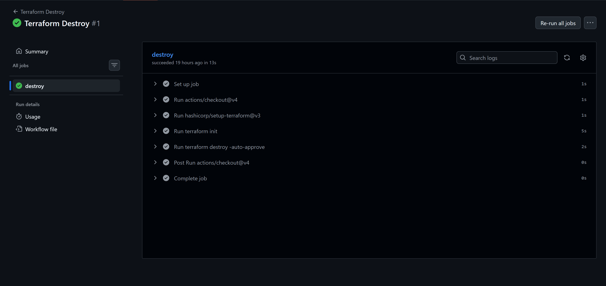
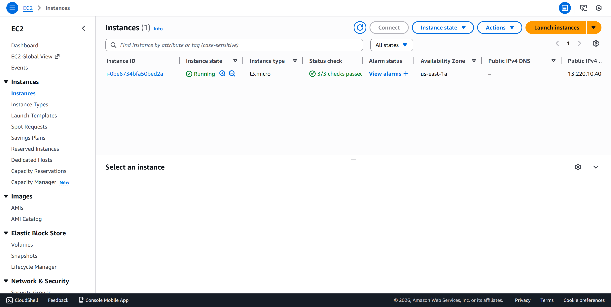
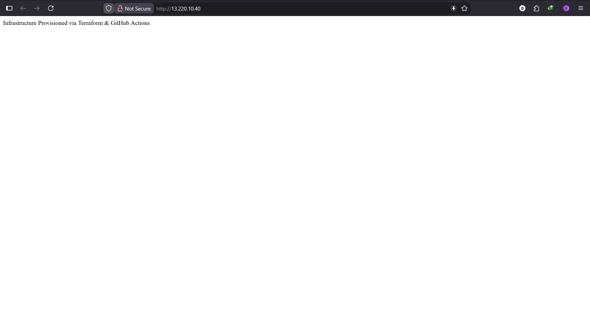

# Terraform GitOps AWS Infrastructure Project

## Overview

This project demonstrates **Infrastructure as Code (IaC)** and **GitOps principles** by automating the provisioning of AWS infrastructure using **Terraform** and **GitHub Actions**.

Whenever code is pushed to the `main` branch, GitHub Actions automatically runs Terraform to create cloud resources in AWS. No manual clicks in the AWS Console are required.

This project is designed to be **AWS Free Tier–safe** and suitable for **beginner to junior DevOps engineers** building a portfolio.

---

## What This Project Demonstrates

- Infrastructure as Code using Terraform
- GitOps workflow using GitHub Actions
- Automated AWS infrastructure provisioning
- Proper AWS networking (VPC, subnet, routing)
- Secure handling of cloud credentials
- Cost-aware infrastructure cleanup

---

## Architecture

The infrastructure created by this project includes:

- **VPC** – Custom private network
- **Public Subnet** – Hosts the EC2 instance
- **Internet Gateway** – Enables internet access
- **Route Table** – Routes traffic to the internet
- **Security Group** – Controls inbound/outbound traffic
- **EC2 Instance (t3.micro)** – Free Tier eligible
- **Nginx Web Server** – Installed automatically via user data

**High-level flow:**

GitHub Push
↓
GitHub Actions
↓
Terraform
↓
AWS Infrastructure (VPC, EC2, Networking)


---

## Tools & Technologies Used

|       Tool     | Purpose |
|----------------|---------|
| Terraform      | Infrastructure as Code |
| GitHub Actions | CI/CD automation |
| AWS EC2        | Compute |
| AWS VPC        | Networking |
| Nginx          | Web server |
| GitHub         | Source control |

---

## Project Structure


```text
terraform-gitops-aws/
│
├── terraform/                     # Terraform root module
│   ├── provider.tf                # AWS provider configuration
│   ├── vpc.tf                     # VPC, subnet, IGW, routing
│   ├── security-group.tf          # Security group rules
│   ├── ec2.tf                     # EC2 instance definition
│   ├── outputs.tf                 # Terraform outputs
│
├── .github/
│   └── workflows/
│       ├── terraform-apply.yml    # Auto apply on push
│       └── terraform-destroy.yml  # Manual cleanup
│
├── user-data/
│   └── install-nginx.sh           # EC2 bootstrap script
│
├── .gitignore
└── README.md
```

---

## ⚙️ How the Automation Works

### Terraform Apply Workflow

Triggered automatically when code is pushed to the `main` branch.

Steps:
1. Checkout repository
2. Initialize Terraform
3. Validate Terraform configuration
4. Apply infrastructure changes

### Terraform Destroy Workflow

Triggered manually from GitHub Actions.

Purpose:
- Clean up AWS resources
- Avoid unnecessary cloud costs

---

## Security & Best Practices

- AWS credentials are stored securely using **GitHub Secrets**
- No credentials are hard-coded
- Infrastructure is fully reproducible
- Explicit networking configuration (no AWS defaults)
- Free Tier–safe instance type (`t3.micro`)

---

## How to Run the Project

### Prerequisites
- AWS account
- GitHub account
- AWS IAM user with programmatic access
- Git installed locally

### Setup Steps

1. Clone the repository
2. Add AWS credentials as GitHub Secrets:
   - `AWS_ACCESS_KEY_ID`
   - `AWS_SECRET_ACCESS_KEY`
   - `AWS_REGION`
3. Push code to the `main` branch
4. GitHub Actions will automatically provision infrastructure

---

## Verifying the Deployment

After a successful GitHub Actions run:

1. Copy the `public_ip` value from the Terraform output
2. Open a browser and navigate to:

http://<public-ip>


You should see:

Infrastructure Provisioned via Terraform & GitHub Actions


---

## Screenshots

### ✅ GitHub Actions – Terraform Apply


### 🧹 GitHub Actions – Terraform Destroy


### ☁️ AWS EC2 Instance Running


### 🌐 Application Accessed via Browser



---

## Cleanup (IMPORTANT)

To avoid AWS charges:

1. Go to **GitHub → Actions**
2. Run the **Terraform Destroy** workflow
3. Confirm resources are deleted in AWS Console

---


## Conclusion

This project demonstrates a real-world DevOps workflow using modern tools and best practices. It shows how infrastructure can be managed safely, repeatably, and automatically using GitOps principles.

---


